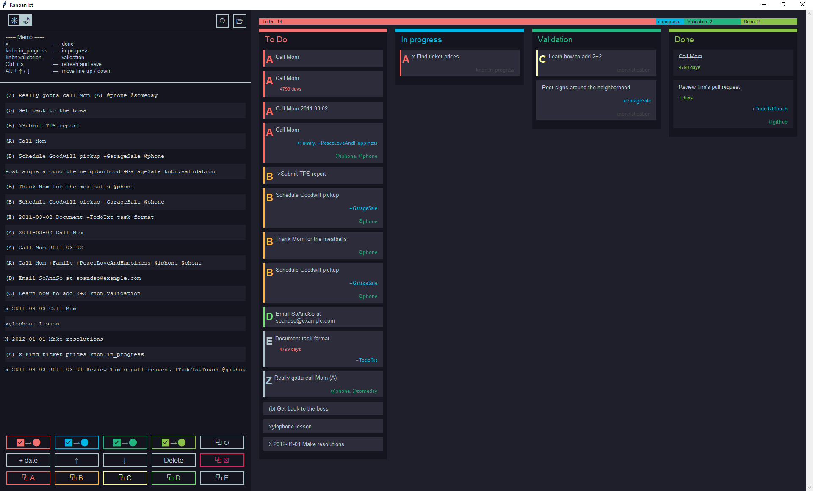

# KanbanTxt

A light todo.txt editor that display the to do list as a kanban board. See [here](https://github.com/todotxt/todo.txt) for a detailed description of the todo.txt format.

The goal was to have a one file script that open a tkinter GUI to edit my todo.txt files and displaying a kanban view of my tasks.

The interface looks as follows, with full support of the todo.txt format:



Application icon from [icons8](https://icons8.com/icon/E1n2Jj29WyVH/kanban). 

## Prerequisites

- Python 3
- Know the todo.txt format (see [here](https://github.com/todotxt/todo.txt) for a detailed description of the todo.txt format)

### Linux

For usage in Linux, you have to install the following dependencies for Python:
- python3-tk
- idle3

For Debian-based distros it can be done via:
```
sudo apt install python3-tk idle3
```

## Installation

Just download the KanbanTxt.py script.

## Usage

### Run KanbanTxt

```
python KanbanTxt.py
```

On Windows, you can also use the `pythonw` executor instead of `python`, to not open the console window alongside the Kanban window:
```
pythonw KanbanTxt.py
```

By adding the `--file` parameter it is possible to open a todo.txt file while opening KanbanTxt

```
python KanbanTxt.py --file=path/to/my/todo.txt
```

Or the button "Open" in the GUI allows to open a file through GUI.

### Edit the to do list

To edit the to do list you can use the integrated text editor to the left of the kanban board panel. To refresh the kanban view, press *ctrl + space*.

### Select a task

You can click on the text in a task card to move the cursor of text editor to the right line.

### Search a task

To search for tasks, press *ctrl + f* or use the text input box "filter tasks:" above the text editor. Confirm by pressing the *enter* key or the "apply" button.

The application will switch to the filter view. In this view you can modify filtered tasks and save the file, but you can't remove or add any new tasks, also opening new file is not possible.

To close the filter view, press *esc* or click on the "close" button.

By default, application uses a simple search, checking whether the line contains entered filter text, ignoring letters' case. You can do an advanced search using the regex mode, which you can turn on with the "use regex" checkbox.

### Move a card to another column

I used the todo.txt special key-val tags to define in which column each task should appear.

- `knbn:in_progress` tag: A task is being work on, it's displayed in the "In progress" column. 
- `knbn:validate` tag: This task is done but need to be validate before considering it as finished. It goes to the *Validation* column.
- `x ` prefix: This task is finished and goes to the *Done* column.
- A task without a `knbn` key tag and without the `x ` prefix, goes to the *To Do* column, waiting to be treated.

You can grab any task card from its current column and drag it left/right, to drop it to the desired state.

You can also use *ctrl + 1-5* to move the task under the text editor cursor to the corresponding column.
1. To Do
2. Change priority
3. In progress
4. Validation
5. Done

Or you can do the same by using the buttons under the editor.

### Assign priority

To assign priority, use the last row of buttons under the editor.

You can also grab any task card from its current position in column and drag it up/down, to drop it to the desired priority.

Tasks are sorted in columns by their priority. 

Tasks with priority (A) are the most critical and displayed first, then goes (B), (C) and so on, up to (Z). Tasks without priority set are considered the lowest priority, even lower than (Z).

Tasks' priority is displayed next to their contents, with hot-map color coding for priorities A-E.

### Reorder the tasks in the text editor

The buttons with an up and a bottom arrow allow to move the current line of editor one step up or down. The same action can be done with the shortcut *alt + ↑* and *alt + ↓*. Note, that tasks are sorted by priority first, and then by the line number.

### Show the time spent on a task

Using the "+ date" button add the date of the day at the begining of a line in the editor. This allows to define a creation date and a completion date to the task.

If a creation date is provided, KanbanTxt will display the number of days elapsed from the creation date to the current day on the task. If a completion date is provided, KanbanTxt will add a label to show the time spent on the task.

### Customize interface

#### Change font size

You can make the task cards' font smaller or bigger by using *ctrl + scroll*.

#### Sort tasks in columns

You can choose different order of displaying tasks in columns. 

You can do this from the 'Customize view' menu (press the eye button on the top left or *alt + v*) by selecting sorting order of you choosing.

Available orders:
- Task priority (default):  
    - Sort by task priority: tasks with priority (A) will be put first, then (B)... up to (Z).  
      Tasks without set priority will be put last.  
      Tasks within the same priority will be put in order of their definition in the txt file.
- Reversed task priority:
    - Sort by task reversed priority: tasks with priority (A) will be put last, before (B)... up to (Z).  
      Tasks without set priority will be put first.  
      Tasks within the same priority will be put in reversed order of their definition in the txt file.
- Order in txt file:
    - Tasks are ordered by their definition in the txt file: if a task is defined earlier in txt than the other, it will appear higher.
- Reversed order in txt file:
    - Tasks are ordered in reverse by their definition in the txt file: if a task is defined later in txt than the other, it will appear higher.
- Alphabetically by subject:
    - Tasks are ordered lexicographically by their subject.  
      It won't include priority or other tags defined at the beginning of line in the todo.txt.
- Alphabetically by text:
    - Tasks are ordered lexicographically by their definition in the txt file.  
      It WILL include priority or other tags defined at the beginning of line in the todo.txt.  
      This is similar to sorting by priority, but the tasks without priority will be sorted alphabetically and not by their order in txt file.
- Alphabetically by project:
    - Tasks are ordered lexicographically by their project tags.  
      If task has multiple project tags, they will be first sorted alphabetically.
- Alphabetically by context:
    - Tasks are ordered lexicographically by their context tags.  
      If task has multiple context tags, they will be first sorted alphabetically.

#### Disable task card elements

You can hide unwanted elements of task cards, for example the special key-value data tags.

You can do this from the 'Customize view' menu (press the eye button on the top left or *alt + v*) by deselecting elements you want to hide.

You can disable basically every element of a task card (including its main content, which might be useful if you want to pick blindly some task to do).

#### Use the dark theme

A little switch with a sun and a moon on the top left corner of the application allows to switch between light and dark mode. This setting is not saved and the program always start with the light theme. But you can launch KanbanTxt in dark mode by running: 

```
python KanbanTxt.py --darkmode
```

### Current support of the todo.txt format

- [x] priority prefixes
- [x] multiple project tags `+project`
- [x] multiple context tags `@context`
- [x] creation date
- [x] completion date
- [x] special key/value tags

