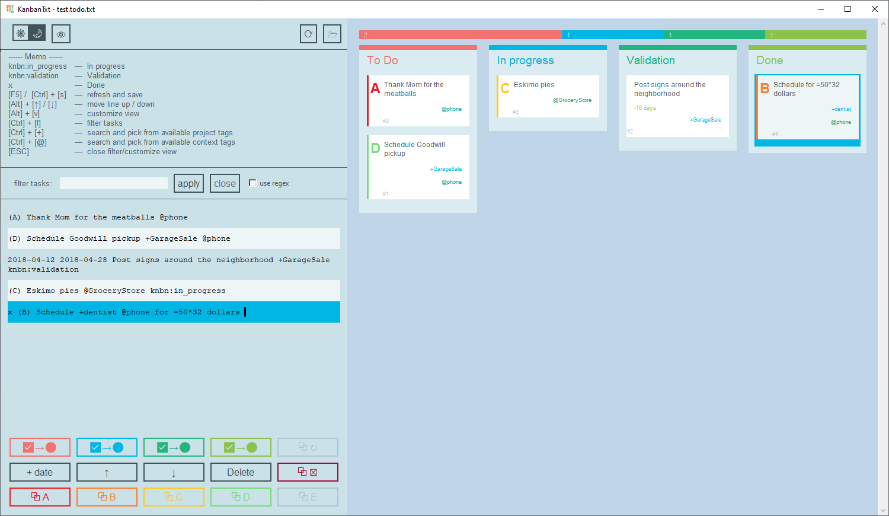
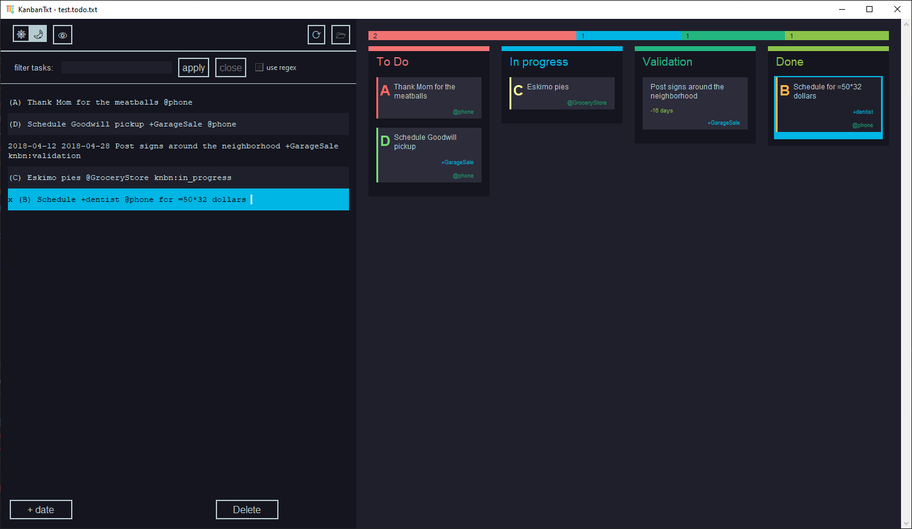
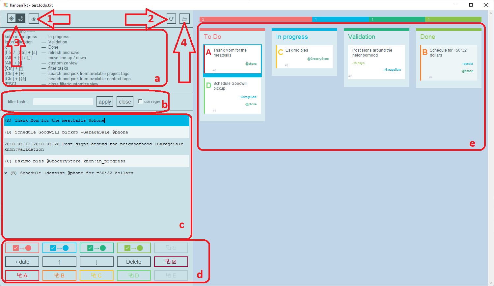
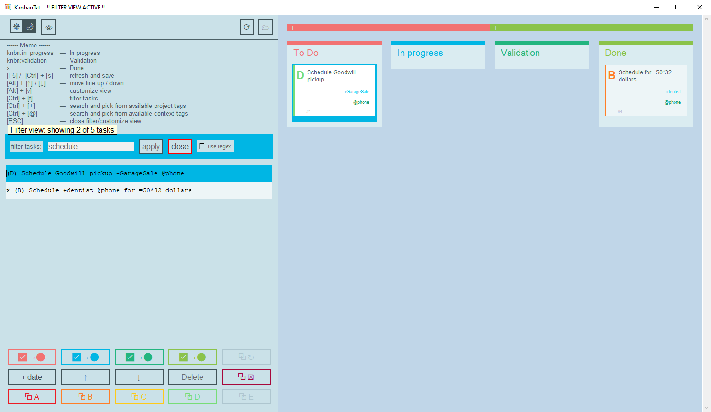
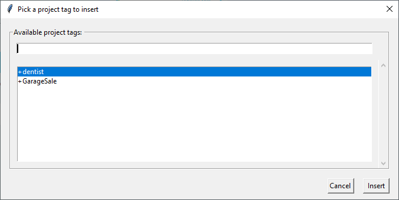
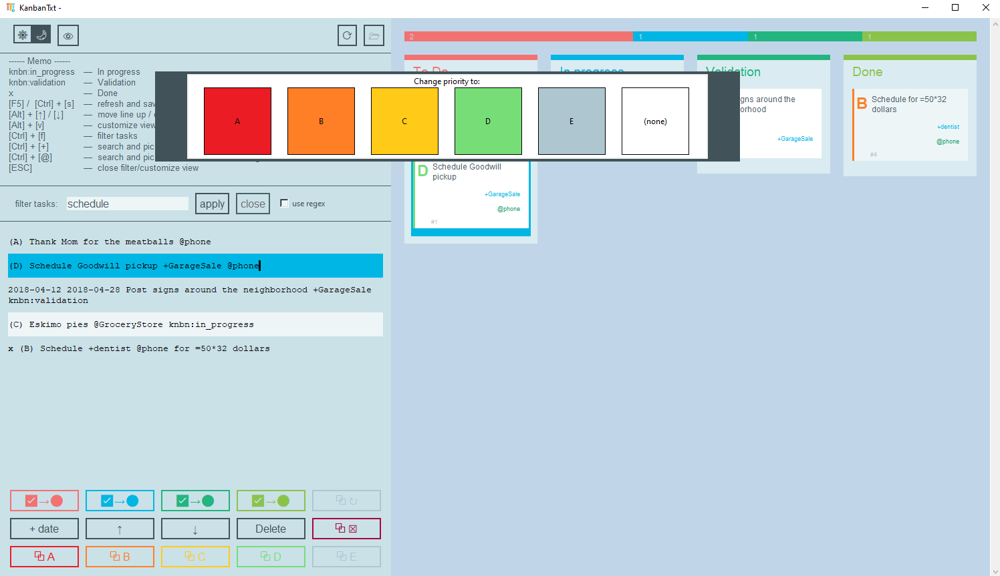

# KanbanTxt

This is a fork of [@KrisNumber24](https://www.github.com/KrisNumber24)'s KanbanTxt, providing extended functionality in terms of covering todo.txt features: multiple project and context tags, support for special key-val tags, proper support for priorities, as well as UI improvements: customizable interface, searching, tags' browsing, drag and drop features and more.   

A light todo.txt editor that display the to do list as a kanban board. See [here](https://github.com/todotxt/todo.txt) for a detailed description of the todo.txt format.

The interface looks as follows, with full support of the todo.txt format:



The UI is customizable, example of dark mode, with hidden elements: memo, task cards' index and most of the control buttons:



Application icon comes from [icons8](https://icons8.com/icon/E1n2Jj29WyVH/kanban). 

## Prerequisites

- Python 3,
- knowledge of the [todo.txt format](https://github.com/todotxt/todo.txt).

### Linux

For usage in Linux, you have to install the following dependencies for Python:
- python3-tk
- idle3

For Debian-based distros it can be done via:
```
sudo apt install python3-tk idle3
```

## Installation

No installation steps are required.

## Usage

### Run KanbanTxt

```
python KanbanTxt.py
```

On Windows, you can also use the `pythonw` executor instead of `python`, to not open the console window alongside the Kanban window:
```
pythonw KanbanTxt.py
```

By adding the `--file` parameter it is possible to open a todo.txt file while opening KanbanTxt

```
python KanbanTxt.py --file=path/to/my/todo.txt
```

### Interface overview

The UI consists of several areas, shown on the screenshot below.



- 1 - 'customize view' button,
- 2 - 'save file and reload UI' button,
- 3 - switch for the dark/light mode,
- 4 - open file button,
- a - memo area, for quick help,
- b - filter tasks area,
- c - text editor for your kanban text.todo file,
- d - task control buttons area,
- e - kanban board panel, consisting of columns with assigned task cards, which you can select, drag between columns and drag to change priority.


### Edit the to do list

To edit the to do list you can use the integrated text editor to the left of the kanban board panel. To refresh the kanban view, press *ctrl + space*.

### Select a task

You can click on the task card to move the cursor of text editor to the corresponding line.

### Search for a task

To search for tasks, press *ctrl + f* or use the text input box "filter tasks:" above the text editor. Confirm by pressing the *enter* key or the "apply" button.

The application will switch to the filter view.



In this view you can modify filtered tasks and save the file, but you can't remove or add any new tasks, also opening new file is not possible.

To close the filter view, press *esc* or click on the "close" button.

By default, application uses a simple search, checking whether the line contains entered filter text, ignoring letters' case. You can do an advanced search using the regex mode, which you can turn on with the "use regex" checkbox.

### Browse tags

You can browse all tags defined in your todo and insert selected tag at the current cursor position.



To browse project tags, press *ctrl + +* (control and plus).

To browse context tags, press *ctrl + @* (control and at).

In the tag selection window, you can use the search entry to filter tags and use mouse cursor or *up* and *down* arrows to select a tag to insert.

You can use *enter* key or click on the "Insert" button to insert currently selected tag. Selected tag will be inserted at the current cursor position in the text editor. New tag will be surrounded with a single space from both sides.

You can use *esc* key or click on the "Cancel" button to close the tag selection window without inserting any tag.  

### Move a card to another column

I used the todo.txt special key-val tags to define in which column each task should appear.

- `knbn:in_progress` tag: A task is being work on, it's displayed in the "In progress" column. 
- `knbn:validate` tag: This task is done but need to be validate before considering it as finished. It goes to the *Validation* column.
- `x ` prefix: This task is finished and goes to the *Done* column.
- A task without a `knbn` key tag and without the `x ` prefix, goes to the *To Do* column, waiting to be treated.

You can grab any task card from its current column and drag it left/right, to drop it to the desired state:


You can also use *ctrl + 1-5* to move the selected task to the corresponding column.
1. To Do
2. Change priority
3. In progress
4. Validation
5. Done

Or you can do the same by using the buttons under the editor.

### Assign priority

To assign priority, you can grab any task card from its current position in column and drag it up/down, to drop it to the desired priority.



You can also use the last row of buttons under the editor.

Tasks are sorted in columns by their priority. 

Tasks with priority (A) are the most critical and displayed first, then goes (B), (C) and so on, up to (Z). Tasks without priority set are considered the lowest priority, even lower than (Z).

Tasks' priority is displayed next to their contents, with hot-map color coding for priorities A-E.

### Reorder the tasks in the text editor

You can change the order of tasks in the text editor, but keep in mind that this will affect their displayed in the task card IDs.

The buttons with an up and a bottom arrow allow to move the current line of editor one step up or down. The same action can be done with the shortcut *alt + ↑* and *alt + ↓*. Note, that by default tasks in the kanban board are sorted by priority first, and then by the line number. You can change this behavior from the customize view panel.

### Show the time spent on a task

Using the "+ date" button add the date of the day at the beginning of a line in the editor. This allows to define a creation date and a completion date to the task.

If a creation date is provided, KanbanTxt will display the number of days elapsed from the creation date to the current day on the task. If a completion date is provided, KanbanTxt will add a label to show the time spent on the task.

### Customize interface

Most of the customization options are available from the 'customize view' dialog.


To access it, press the eye button on the top left or *alt + v*.

#### Change font size

You can make the task cards' font smaller or bigger from the customize view dialog or by using *ctrl + scroll* on the kanban board panel.

#### Sort tasks in columns

From the customize view dialog you can choose different order of displaying tasks in columns.

Available orders:
- Task priority (default):  
    - Sort by task priority: tasks with priority (A) will be put first, then (B)... up to (Z).  
      Tasks without set priority will be put last.  
      Tasks within the same priority will be put in order of their definition in the txt file.
- Reversed task priority:
    - Sort by task reversed priority: tasks with priority (A) will be put last, before (B)... up to (Z).  
      Tasks without set priority will be put first.  
      Tasks within the same priority will be put in reversed order of their definition in the txt file.
- Order in txt file:
    - Tasks are ordered by their definition in the txt file: if a task is defined earlier in txt than the other, it will appear higher.
- Reversed order in txt file:
    - Tasks are ordered in reverse by their definition in the txt file: if a task is defined later in txt than the other, it will appear higher.
- Alphabetically by subject:
    - Tasks are ordered lexicographically by their subject.  
      It won't include priority or other tags defined at the beginning of line in the todo.txt.
- Alphabetically by text:
    - Tasks are ordered lexicographically by their definition in the txt file.  
      It WILL include priority or other tags defined at the beginning of line in the todo.txt.  
      This is similar to sorting by priority, but the tasks without priority will be sorted alphabetically and not by their order in txt file.
- Alphabetically by project:
    - Tasks are ordered lexicographically by their project tags.  
      If task has multiple project tags, they will be first sorted alphabetically.
- Alphabetically by context:
    - Tasks are ordered lexicographically by their context tags.  
      If task has multiple context tags, they will be first sorted alphabetically.

#### Disable task card elements

You can hide unwanted elements of task cards, for example the special key-value data tags.

You can do this from the 'Customize view' dialog, by deselecting elements you want to hide.

You can disable basically every element of a task card, including its main content (which might be useful if you want to pick blindly some random task to do).

#### Use the dark theme

A little switch with a sun and a moon on the top left corner of the application allows to switch between light and dark mode.

### Current support of the todo.txt format

- [x] priority prefixes
- [x] multiple project tags `+project`
- [x] multiple context tags `@context`
- [x] creation date
- [x] completion date
- [x] special key/value tags

